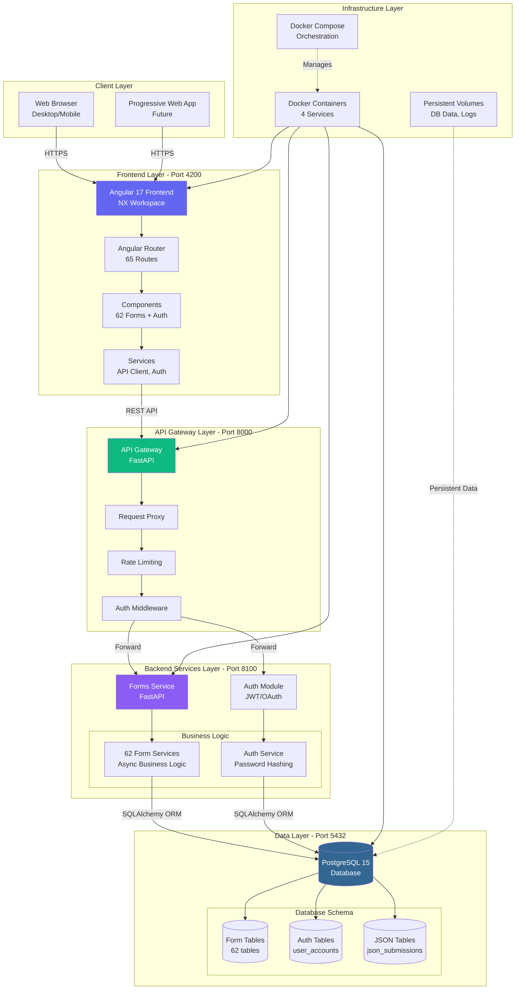
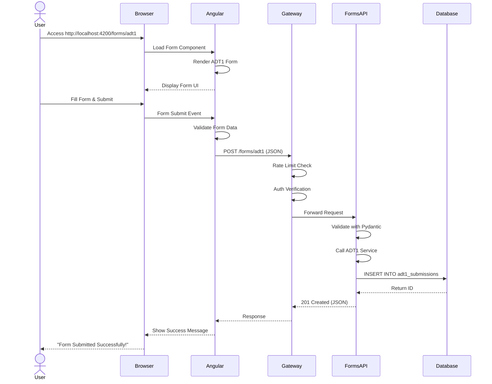
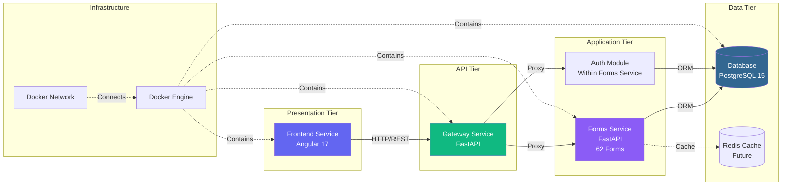
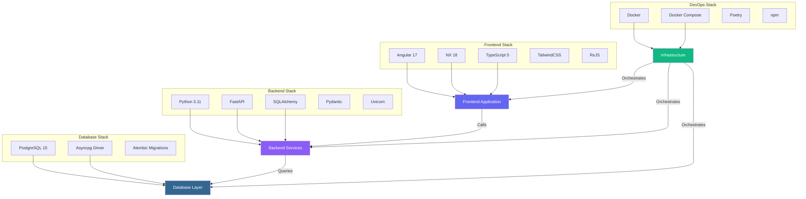
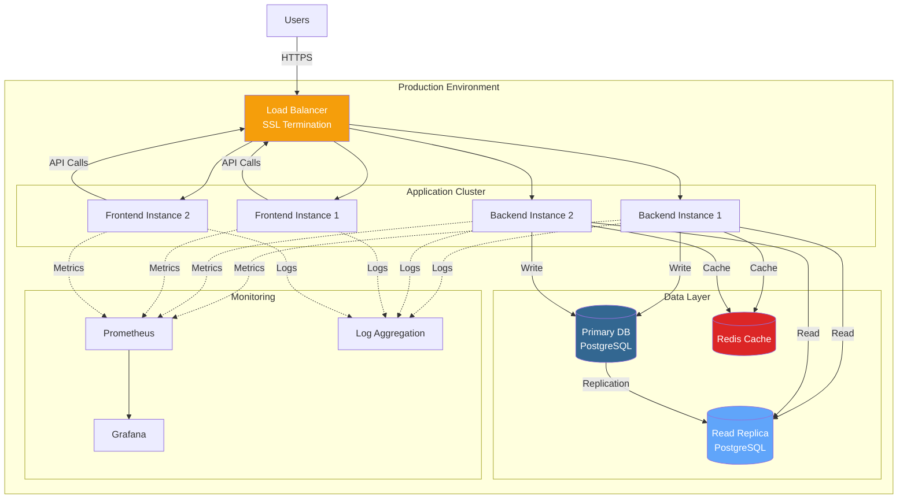
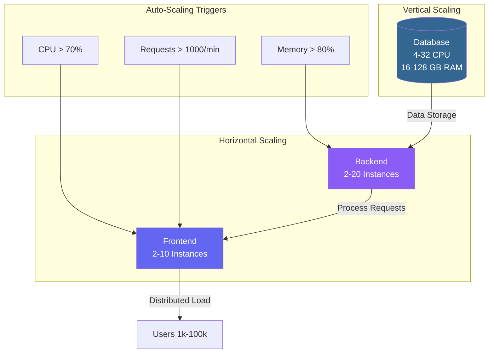

# 🏗️ System/Application Architecture
## ComplyCrafter - Complete System Overview

**Version:** 1.0  
**Date:** October 31, 2025  
**Status:** ✅ Production

---

## 📋 System Overview

ComplyCrafter is a modern, microservices-based MCA forms platform built with Angular, FastAPI, and PostgreSQL.

---

## 🌐 High-Level System Architecture

---

## 🔄 Request Flow

---

## 🏛️ Microservices Architecture

---

## 🔧 Technology Stack

---

## 📊 Component Breakdown

### **Frontend Components: 65**
- Forms: 62 components
- Auth: 2 components (login, signup)
- Navigation: 1 component (forms-list)

### **Backend Services: 63**
- Form Services: 62 services
- Auth Service: 1 service

### **Database Tables: 64**
- Form Tables: 62 tables
- Auth Tables: 1 table (user_accounts)
- JSON Tables: 1 table (json_submissions)

### **API Endpoints: 230**
- Form Endpoints: 227 (GET, POST, PUT, DELETE for 62 forms)
- Auth Endpoints: 3 (signup, login, me)

---

## 🌍 Deployment Architecture

---

## 📈 Scalability Model

---

## ✅ System Characteristics

| Aspect | Implementation | Status |
|--------|----------------|--------|
| **Architecture** | Microservices | ✅ |
| **Frontend** | SPA (Single Page App) | ✅ |
| **Backend** | RESTful API | ✅ |
| **Database** | Relational (PostgreSQL) | ✅ |
| **Async** | Full async/await | ✅ |
| **Containerized** | Docker | ✅ |
| **Scalable** | Horizontal & Vertical | ✅ |
| **Type-Safe** | TypeScript + Pydantic | ✅ |

---

## 🎯 Key Design Principles

1. **Separation of Concerns** - Clear layer separation
2. **Microservices** - Independent, scalable services
3. **API-First** - Well-defined API contracts
4. **Type Safety** - Strong typing throughout
5. **Async Operations** - Non-blocking I/O
6. **Containerization** - Portable, reproducible environments
7. **Documentation** - Auto-generated API docs

---

**Version:** 1.0  
**Last Updated:** October 31, 2025  
**Status:** ✅ Production Ready

