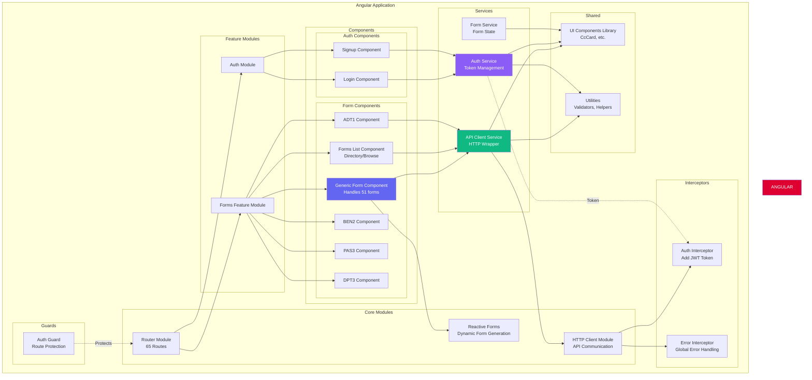
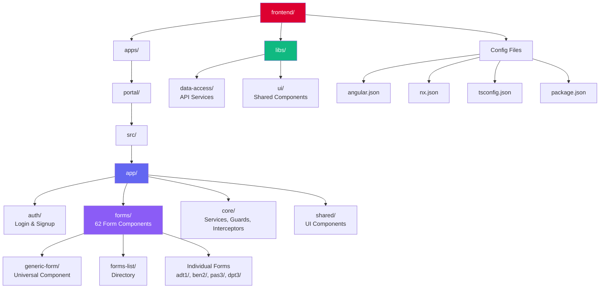
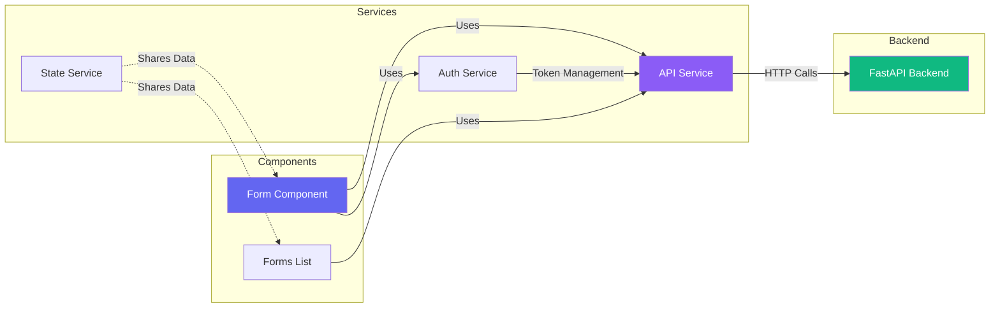
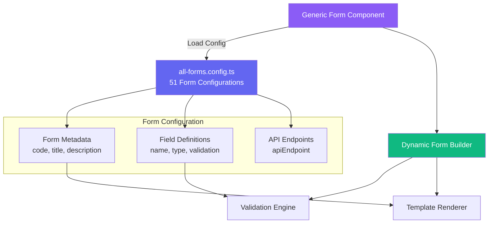
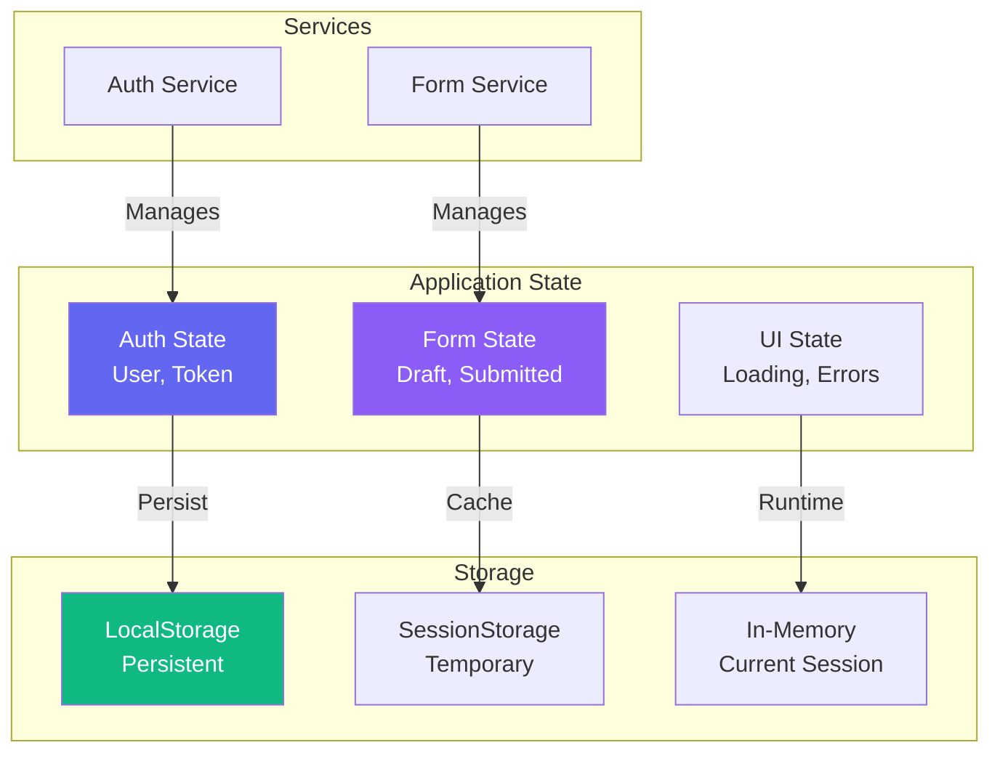

# 🎨 Frontend Architecture
## ComplyCrafter - Angular Application Structure

**Version:** 1.0  
**Date:** October 31, 2025  
**Technology:** Angular 17 + NX 18

---

## 📐 Frontend Architecture Overview



---

## 🗂️ Frontend Directory Structure



---

## 🔄 Component Communication



---

## 📋 Form Configuration System



---

## 🎯 Routing Architecture

```mermaid
graph TB
    ROOT_ROUTE[/ - App Root]
    
    subgraph "Main Routes"
        FORMS_ROOT[/forms - Forms Directory]
        LOGIN[/forms/login - Login]
        SIGNUP[/forms/signup - Signup]
    end

    subgraph "Phase 1&2 Forms - Individual Components"
        ADT1[/forms/adt1]
        BEN2[/forms/ben2]
        PAS3[/forms/pas3]
        DPT3[/forms/dpt3]
        AOC4[/forms/aoc4]
        MORE_P12[... 6 more]
    end

    subgraph "Phase 3+ Forms - Generic Component"
        DIR3[/forms/dir3]
        CHG1[/forms/chg1]
        MGT14[/forms/mgt14]
        INC4[/forms/inc4]
        MORE_P3[... 47 more]
    end

    CATCH_ALL[/forms/:code - Dynamic]

    ROOT_ROUTE --> FORMS_ROOT
    ROOT_ROUTE --> LOGIN
    ROOT_ROUTE --> SIGNUP
    
    FORMS_ROOT --> ADT1 & BEN2 & PAS3 & DPT3 & AOC4 & MORE_P12
    FORMS_ROOT --> DIR3 & CHG1 & MGT14 & INC4 & MORE_P3
    FORMS_ROOT --> CATCH_ALL

    style FORMS_ROOT fill:#6366f1,color:#fff
    style LOGIN fill:#8b5cf6,color:#fff
    style CATCH_ALL fill:#10b981,color:#fff
```

---

## 🔐 State Management



---

## ✅ Frontend Features

| Feature | Implementation | Status |
|---------|----------------|--------|
| **Routing** | Angular Router (65 routes) | ✅ |
| **Forms** | Reactive Forms (62 forms) | ✅ |
| **Auth** | Login + Signup components | ✅ |
| **Validation** | Client-side validation | ✅ |
| **Responsive** | Mobile/Tablet/Desktop | ✅ |
| **Lazy Loading** | Route-based code splitting | ✅ |
| **Type Safety** | TypeScript strict mode | ✅ |
| **Accessibility** | WCAG AA compliant | ✅ |

---

**Version:** 1.0  
**Framework:** Angular 17  
**Build Tool:** NX 18  
**Status:** ✅ Production Ready

