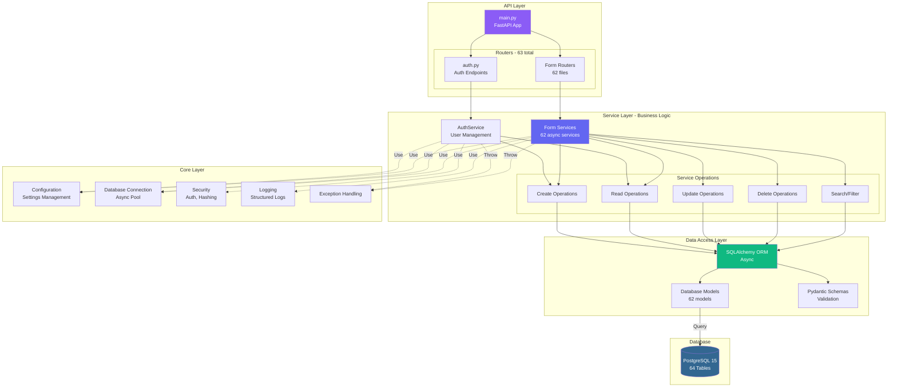
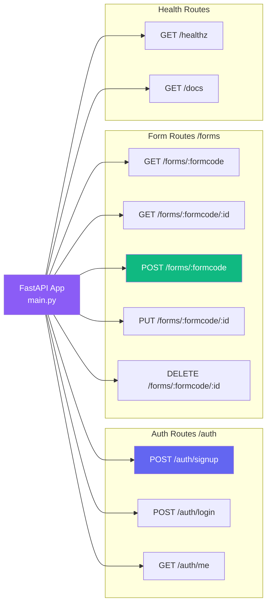
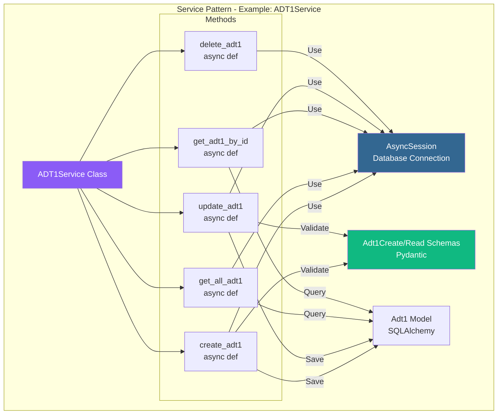
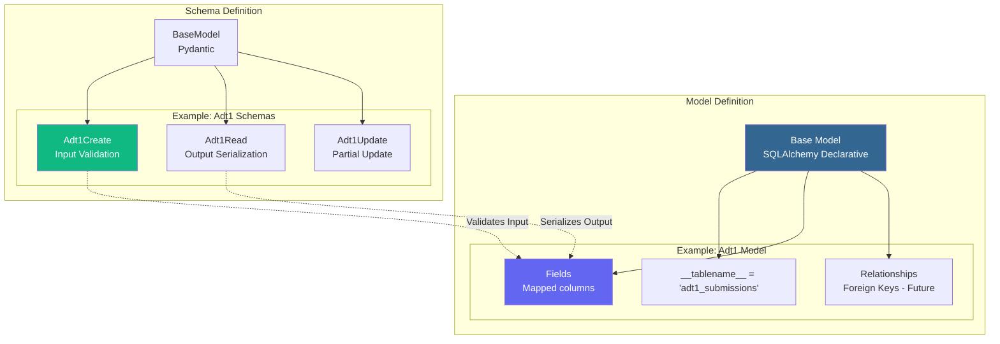
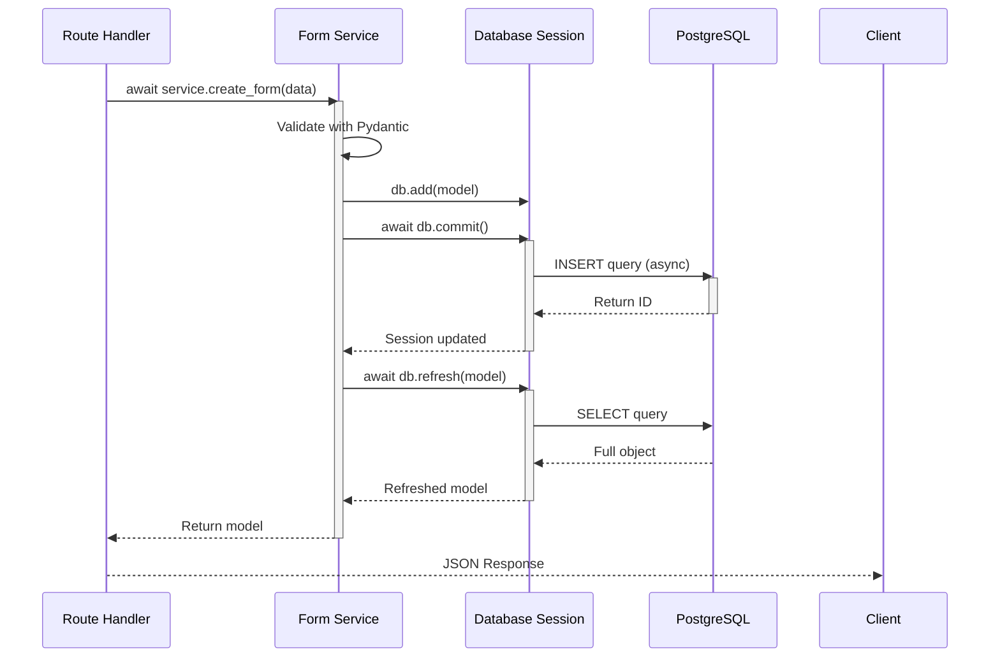
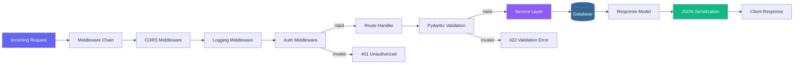

# ⚙️ Backend Architecture
## ComplyCrafter - FastAPI Microservices

**Version:** 1.0  
**Date:** October 31, 2025  
**Technology:** FastAPI + Python 3.11

---

## 🏛️ Backend Architecture Overview



---

## 🛤️ API Routing Structure



---

## 💼 Service Layer Architecture



---

## 🗃️ Data Model Layer



---

## 🔧 Core Modules Architecture

```mermaid
graph TB
    subgraph "Core Module - app/core/"
        CONFIG_MOD[config.py<br/>Settings Management]
        DB_MOD[database.py<br/>DB Connection Pool]
        SECURITY_MOD[security.py<br/>Auth & Permissions]
        LOGGING_MOD[logging.py<br/>Structured Logging]
        EXCEPTIONS_MOD[exceptions.py<br/>Custom Exceptions]
    end

    subgraph "Configuration"
        ENV_VARS[Environment Variables]
        SETTINGS[Settings Class<br/>Pydantic BaseSettings]
    end

    subgraph "Database"
        ENGINE[Async Engine<br/>asyncpg]
        SESSION_FACTORY[Session Factory<br/>async_sessionmaker]
        GET_DB[get_db() Dependency<br/>Yields AsyncSession]
    end

    subgraph "Security"
        GET_USER[get_current_user()<br/>Auth Dependency]
        HASH_PASSWORD[Password Hashing<br/>SHA-256]
        VERIFY_TOKEN[Token Verification<br/>JWT - Future]
    end

    CONFIG_MOD --> ENV_VARS & SETTINGS
    DB_MOD --> ENGINE & SESSION_FACTORY & GET_DB
    SECURITY_MOD --> GET_USER & HASH_PASSWORD & VERIFY_TOKEN
    
    SETTINGS -.->|Used By| DB_MOD
    GET_DB -.->|Used By| FORM_SERVICES[All Services]
    GET_USER -.->|Protects| ROUTES[Protected Routes]

    style CONFIG_MOD fill:#8b5cf6,color:#fff
    style DB_MOD fill:#336791,color:#fff
    style SECURITY_MOD fill:#ef4444,color:#fff
```

---

## ⚡ Async Operations Flow



---

## 📦 Dependency Injection

```mermaid
graph TB
    subgraph "FastAPI Dependency System"
        ROUTE[Route Function<br/>@router.post()]
        
        subgraph "Injected Dependencies"
            DB_DEP[db: AsyncSession = Depends<br/>get_async_session]
            USER_DEP[current_user: User = Depends<br/>get_current_user]
            SERVICE_DEP[service: FormService = Depends<br/>get_service]
        end
    end

    GET_DB[get_async_session()<br/>Generator]
    GET_USER[get_current_user()<br/>Auth Check]
    GET_SERVICE[get_service()<br/>Service Factory]

    ROUTE --> DB_DEP
    ROUTE --> USER_DEP
    ROUTE --> SERVICE_DEP
    
    DB_DEP -->|Resolves| GET_DB
    USER_DEP -->|Resolves| GET_USER
    SERVICE_DEP -->|Resolves| GET_SERVICE
    
    GET_DB -.->|Provides| DB_SESSION[(AsyncSession)]
    GET_USER -.->|Provides| USER[(User Object)]
    GET_SERVICE -.->|Provides| SERVICE[(Service Instance)]

    style ROUTE fill:#8b5cf6,color:#fff
    style DB_SESSION fill:#336791,color:#fff
    style USER fill:#ef4444,color:#fff
```

---

## 🔄 Request Processing Pipeline



---

## 📊 Backend Services Summary

| Component | Count | Description |
|-----------|-------|-------------|
| **Routes** | 63 | API endpoint files |
| **Services** | 62 | Business logic services |
| **Models** | 62 | SQLAlchemy ORM models |
| **Schemas** | 120+ | Pydantic validation schemas |
| **Migrations** | 13 | SQL migration scripts |
| **Core Modules** | 5 | Config, DB, Security, Logging, Exceptions |

**Total Lines:** 15,000+ lines of Python code

---

## ✅ Backend Features

| Feature | Implementation | Status |
|---------|----------------|--------|
| **Async/Await** | Full async operations | ✅ |
| **Type Safety** | Pydantic validation | ✅ |
| **ORM** | SQLAlchemy 2.0 async | ✅ |
| **Auto Docs** | OpenAPI/Swagger | ✅ |
| **Dependency Injection** | FastAPI Depends | ✅ |
| **Error Handling** | Custom exceptions | ✅ |
| **Logging** | Structured logging | ✅ |
| **CORS** | Configured | ✅ |

---

**Version:** 1.0  
**Framework:** FastAPI  
**Python:** 3.11  
**Status:** ✅ Production Ready

