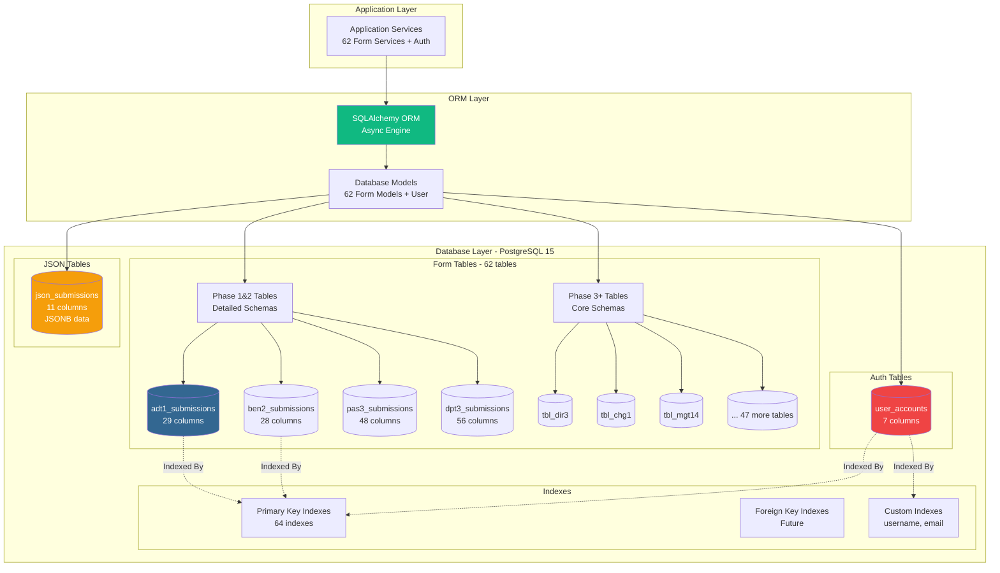
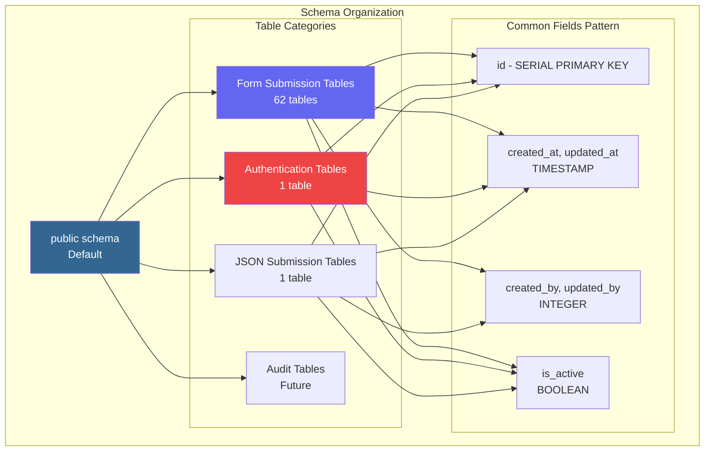
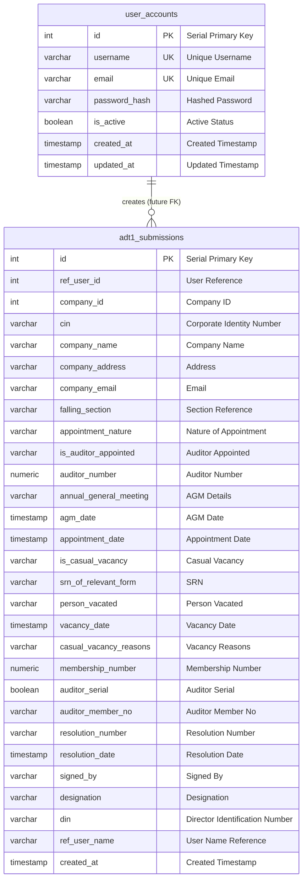
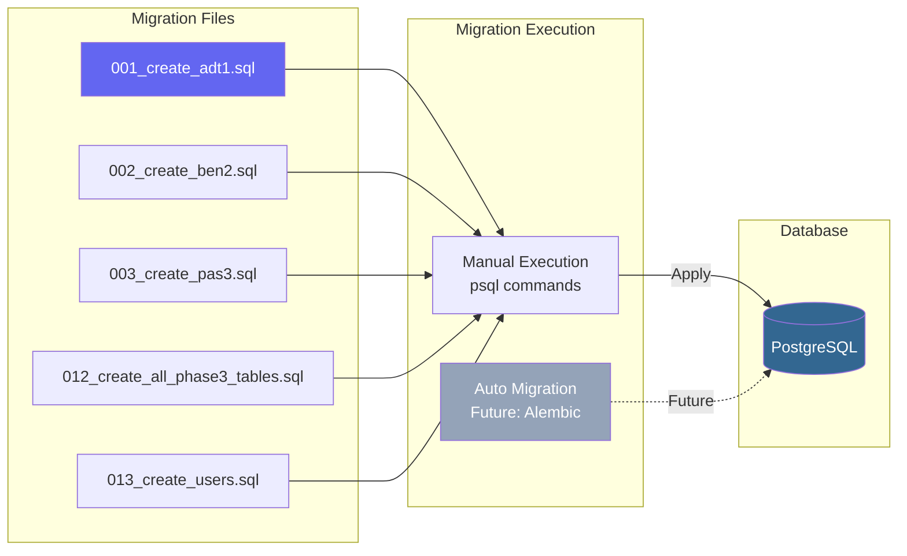
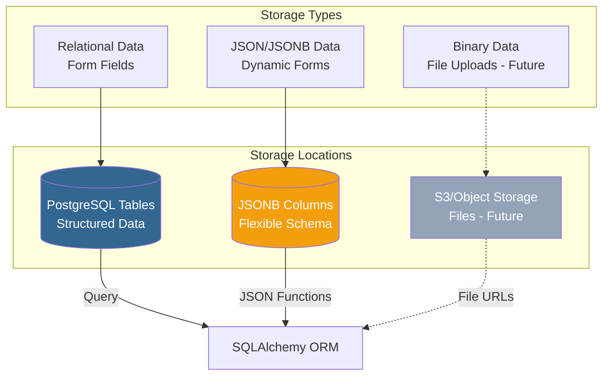
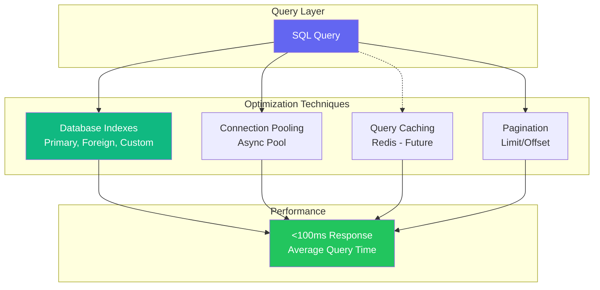
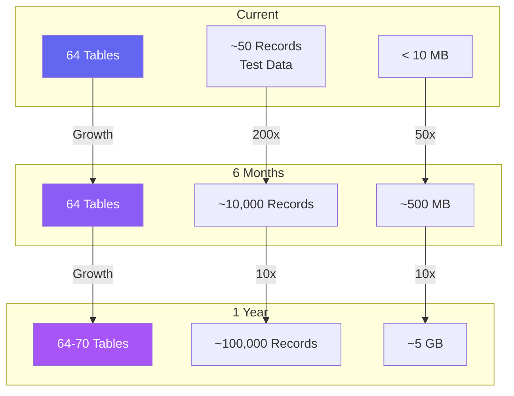

# 🗄️ Data Architecture
## ComplyCrafter - Database Design & Structure

**Version:** 1.0  
**Date:** October 31, 2025  
**Database:** PostgreSQL 15

---

## 📊 Data Architecture Overview

---

## 🗂️ Database Schema Layers

---

## 📋 Table Schema Example - ADT1

---

## 🔄 Database Migration Strategy

---

## 💾 Data Storage Strategy

---

## 🔍 Query Optimization

---

## 📈 Data Volume Estimates

---

## ✅ Data Architecture Features

| Feature | Implementation | Status |
|---------|----------------|--------|
| **Database** | PostgreSQL 15 | ✅ |
| **ORM** | SQLAlchemy 2.0 async | ✅ |
| **Migrations** | SQL scripts | ✅ |
| **Indexes** | Primary keys + custom | ✅ |
| **JSON Support** | JSONB columns | ✅ |
| **Connection Pool** | Async pool | ✅ |
| **Performance** | <100ms avg | ✅ |
| **Backup** | Planned | 🎯 |

---

**Version:** 1.0  
**Database:** PostgreSQL 15  
**Tables:** 64  
**Status:** ✅ Production Ready

