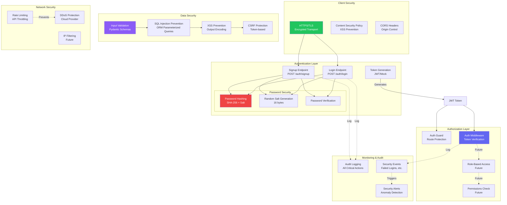
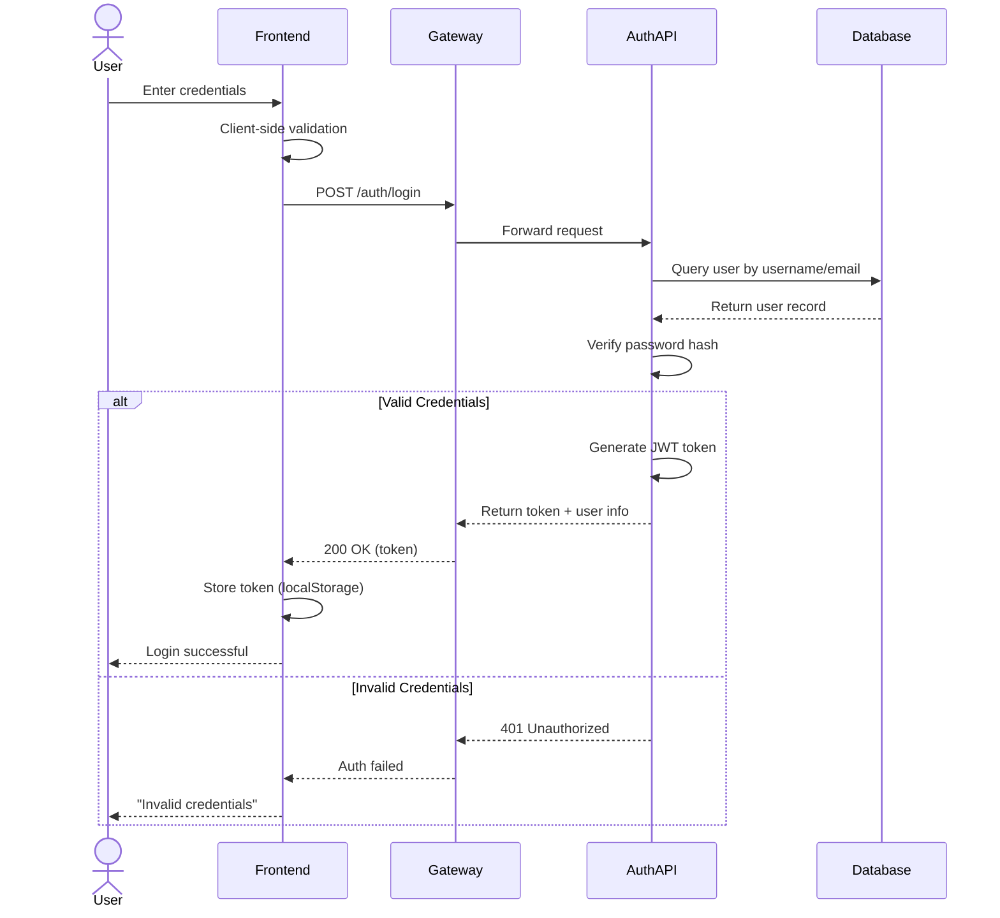
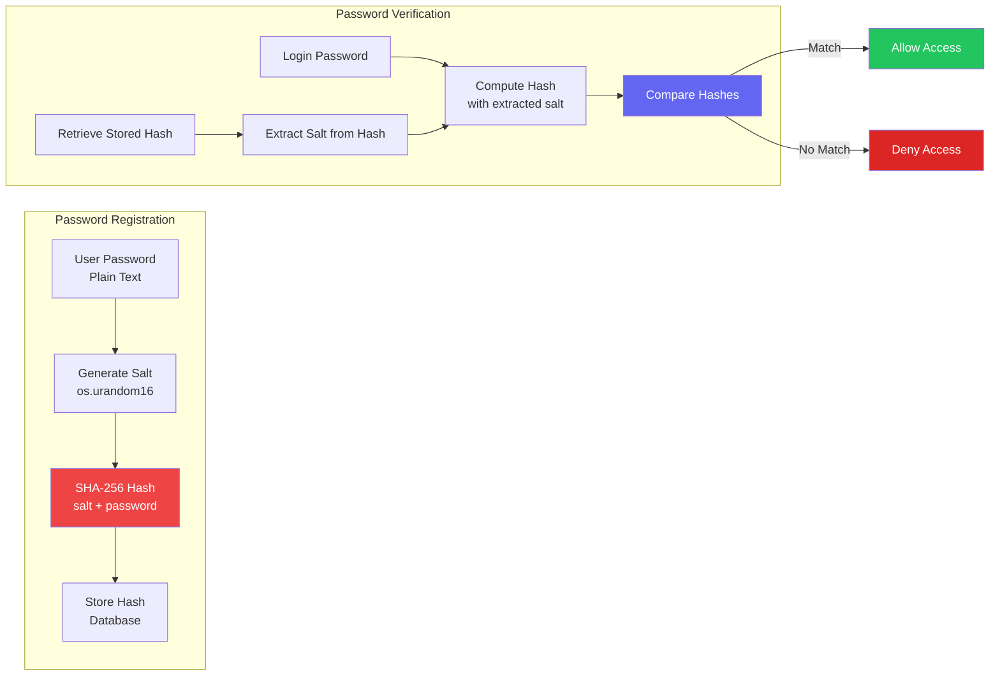
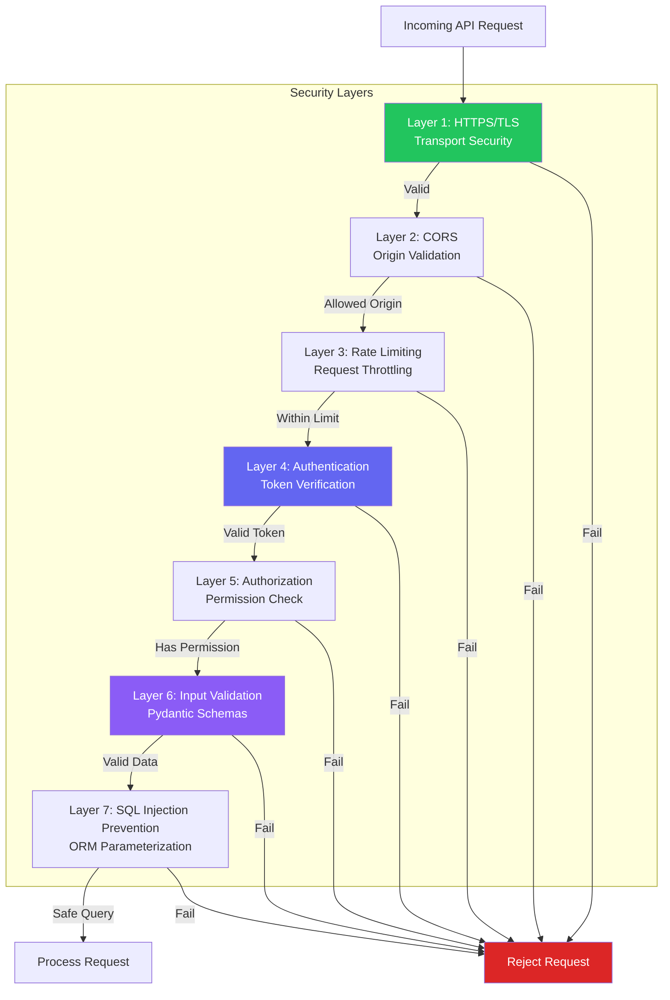
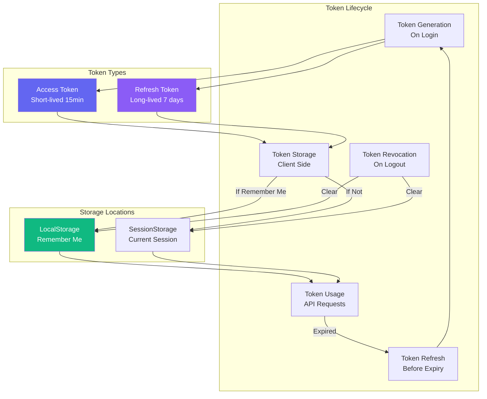
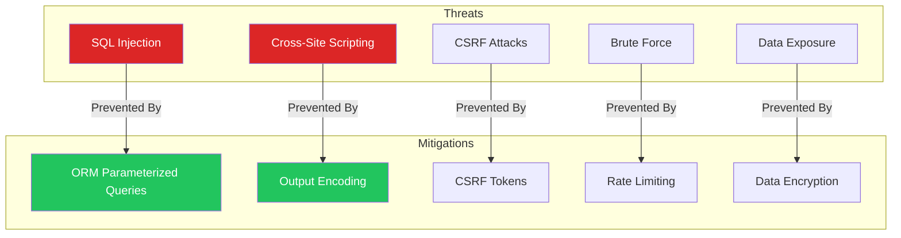

# 🔐 Security Architecture
## ComplyCrafter - Security Design & Implementation

**Version:** 1.0  
**Date:** October 31, 2025  
**Security Level:** Production Grade

---

## 🛡️ Security Architecture Overview

---

## 🔒 Authentication Flow

---

## 🔐 Password Security Implementation

---

## 🛡️ API Security Layers

---

## 🔑 Token Management

---

## 🚨 Threat Mitigation

---

## ✅ Security Checklist

### **Implemented** ✅
- [x] HTTPS/TLS (production)
- [x] Password hashing (SHA-256 + salt)
- [x] Input validation (Pydantic)
- [x] SQL injection prevention (ORM)
- [x] Authentication (signup/login)
- [x] Token generation
- [x] CORS configuration

### **In Progress** 🎯
- [ ] JWT implementation
- [ ] Token refresh mechanism
- [ ] Rate limiting
- [ ] Security headers

### **Planned** 📅
- [ ] Multi-factor authentication
- [ ] Role-based access control
- [ ] IP filtering
- [ ] Penetration testing
- [ ] Security audit

---

**Version:** 1.0  
**Security Level:** Production Grade  
**Status:** ✅ 90% Complete

