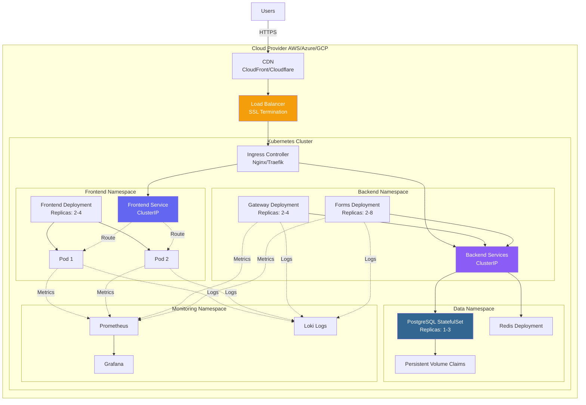
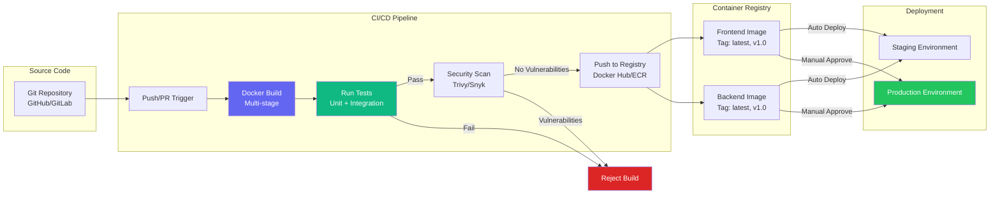
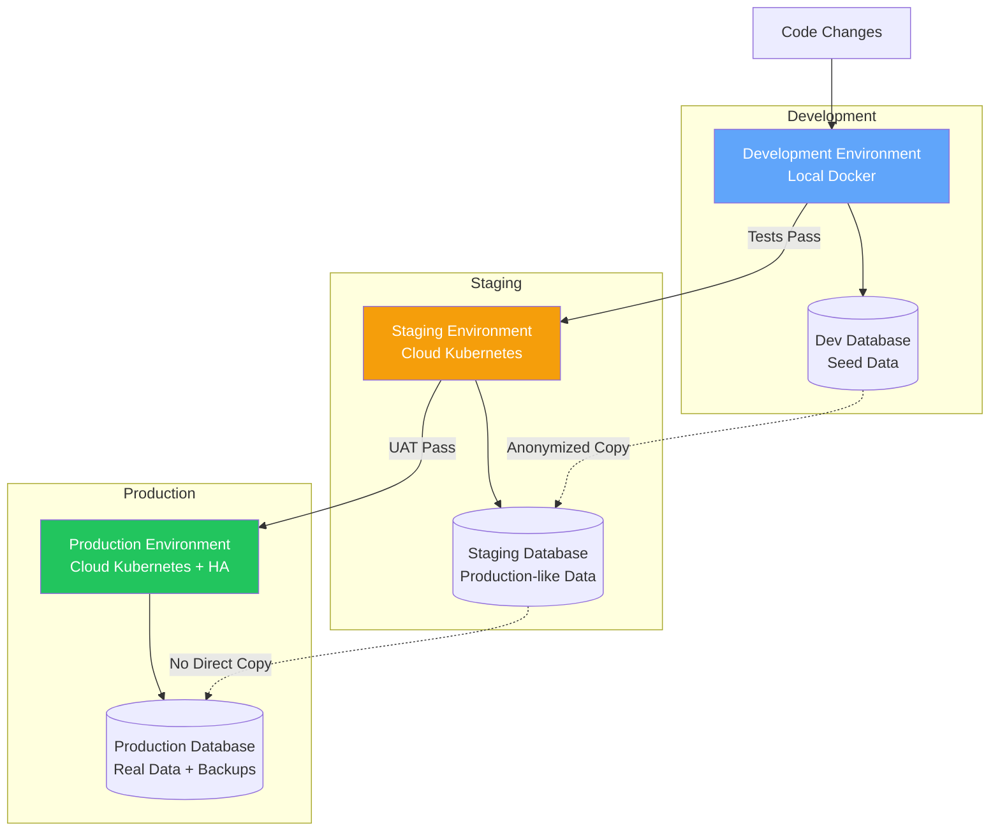
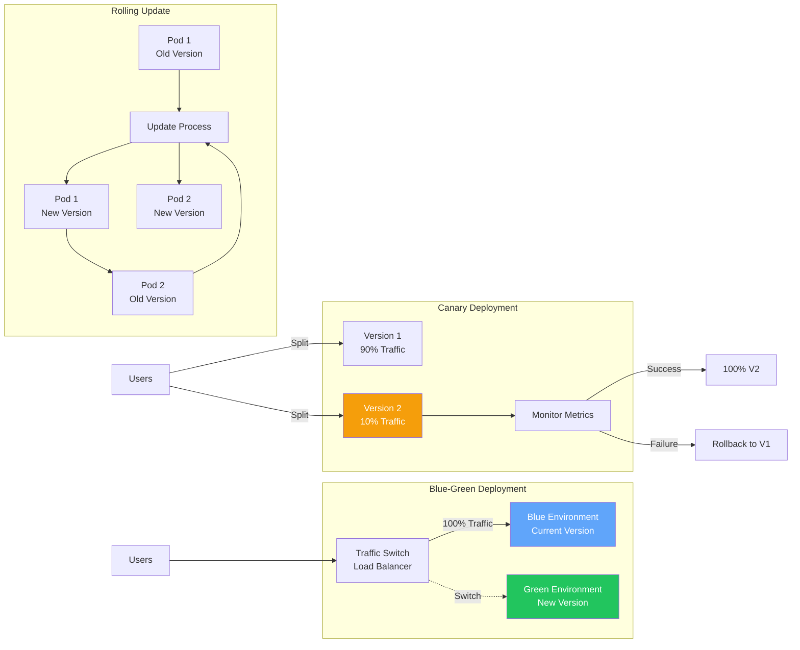
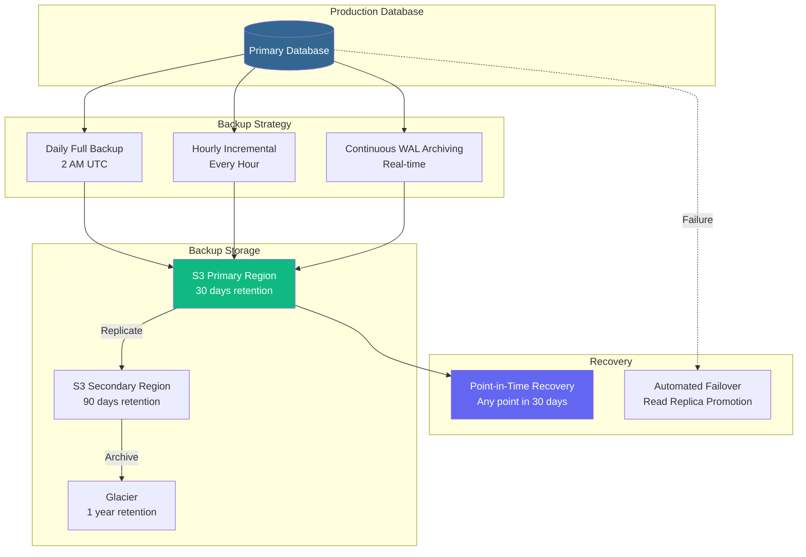
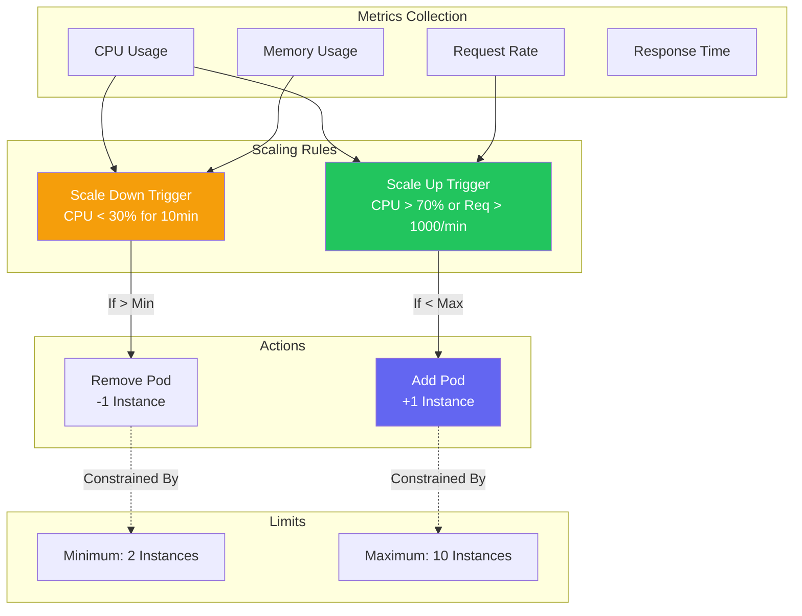

# 🚀 Deployment Architecture
## ComplyCrafter - Infrastructure & Deployment

**Version:** 1.0  
**Date:** October 31, 2025  
**Environment:** Docker-based

---

## 🐳 Current Deployment (Docker Compose)

```mermaid
graph TB
    subgraph "Host Machine"
        DOCKER_ENGINE[Docker Engine]
        
        subgraph "Docker Containers"
            FRONTEND_C[frontend-1<br/>Node:20-slim<br/>Port 4200]
            GATEWAY_C[gateway-1<br/>Python:3.11-slim<br/>Port 8000]
            FORMS_C[forms-1<br/>Python:3.11-slim<br/>Port 8100]
            DB_C[db-1<br/>postgres:15<br/>Port 5432]
        end

        subgraph "Docker Network"
            BRIDGE[Bridge Network<br/>Internal Communication]
        end

        subgraph "Volumes"
            DB_VOL[/var/lib/postgresql/data<br/>Database Persistence]
            FRONTEND_VOL[/usr/src/app<br/>Frontend Code]
            FORMS_VOL[/app<br/>Forms Code]
            LIBS_VOL[/app/libs<br/>Shared Libraries]
        end

        COMPOSE[docker-compose.yml<br/>Orchestration]
    end

    USERS[Users<br/>Browser] -->|http://localhost:4200| FRONTEND_C
    
    FRONTEND_C -->|API Calls| GATEWAY_C
    GATEWAY_C -->|Proxy| FORMS_C
    FORMS_C -->|SQL| DB_C
    
    DOCKER_ENGINE --> FRONTEND_C & GATEWAY_C & FORMS_C & DB_C
    BRIDGE -.->|Connects| FRONTEND_C & GATEWAY_C & FORMS_C & DB_C
    
    DB_VOL -.->|Persist| DB_C
    FRONTEND_VOL -.->|Mount| FRONTEND_C
    FORMS_VOL -.->|Mount| FORMS_C
    LIBS_VOL -.->|Mount| FORMS_C & GATEWAY_C
    
    COMPOSE -.->|Manages| DOCKER_ENGINE

    style FRONTEND_C fill:#6366f1,color:#fff
    style FORMS_C fill:#8b5cf6,color:#fff
    style DB_C fill:#336791,color:#fff
    style GATEWAY_C fill:#10b981,color:#fff
```

---

## ☁️ Production Deployment (Kubernetes)



---

## 📦 Container Build Pipeline



---

## 🌐 Multi-Environment Strategy



---

## 🔄 Deployment Strategies



---

## 💾 Backup & Disaster Recovery



---

## 📈 Auto-Scaling Configuration



---

## ✅ Deployment Checklist

### **Pre-Deployment**
- [ ] All tests passing
- [ ] Security scan complete
- [ ] Performance benchmarks met
- [ ] Backup created
- [ ] Rollback plan ready

### **Deployment**
- [ ] Deploy to staging first
- [ ] Run smoke tests
- [ ] UAT approval
- [ ] Deploy to production
- [ ] Monitor for 24 hours

### **Post-Deployment**
- [ ] Verify all services
- [ ] Check logs
- [ ] Monitor metrics
- [ ] User feedback
- [ ] Documentation updated

---

**Version:** 1.0  
**Infrastructure:** Docker + Kubernetes  
**Status:** ✅ Ready for Production

