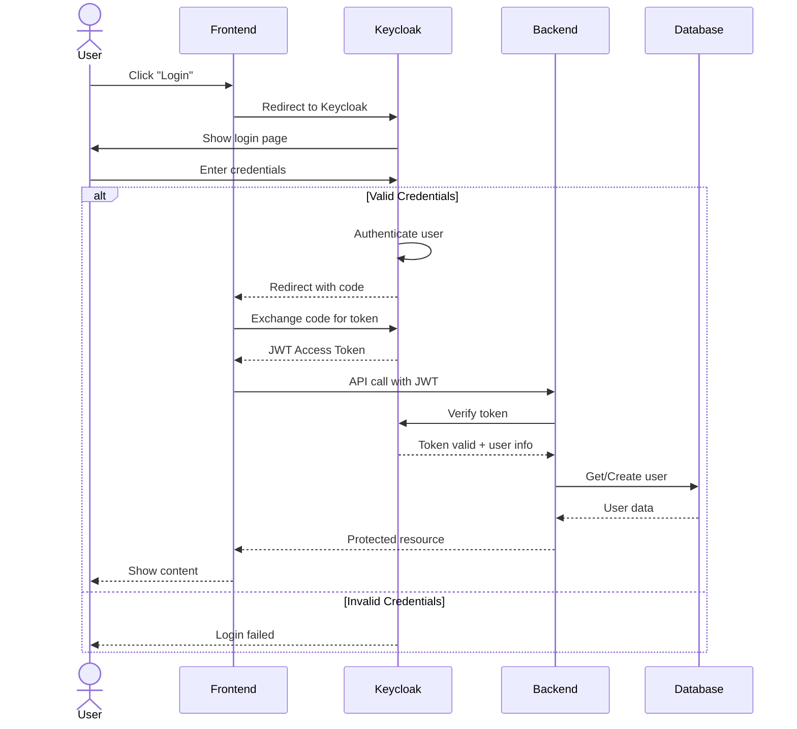
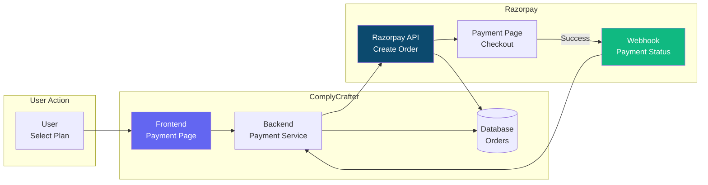
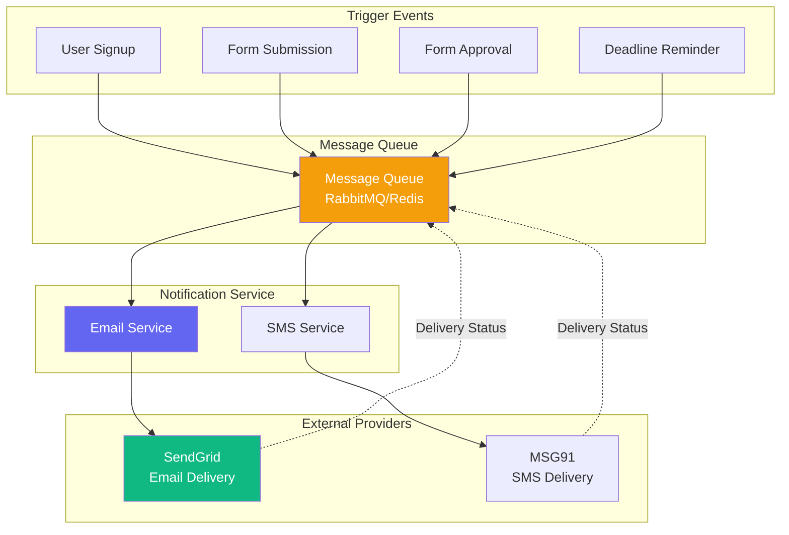
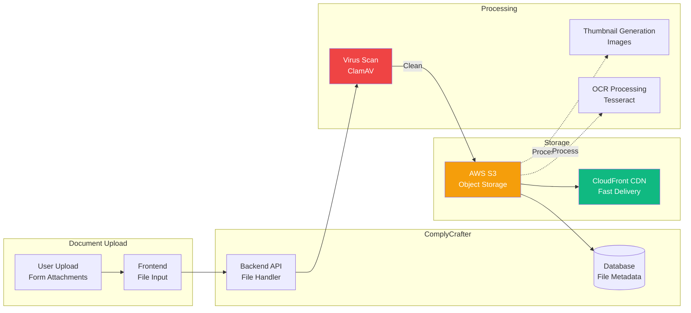
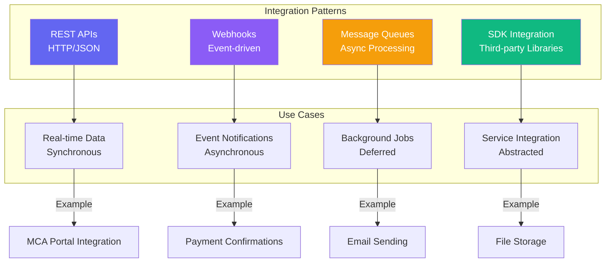
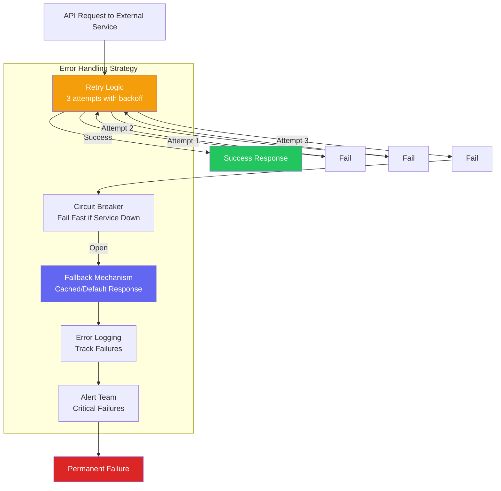

# 🔗 Integration Architecture
## ComplyCrafter - External System Integrations

**Version:** 1.0  
**Date:** October 31, 2025  
**Integrations:** Current + Planned

---

## 🌐 Integration Overview

```mermaid
graph TB
    subgraph "ComplyCrafter Platform"
        FRONTEND[Angular Frontend]
        BACKEND[FastAPI Backend]
        DATABASE[(PostgreSQL Database)]
    end

    subgraph "External Integrations"
        subgraph "Authentication - Future"
            KEYCLOAK[Keycloak SSO<br/>OAuth 2.0/OIDC]
            GOOGLE_AUTH[Google OAuth]
            MS_AUTH[Microsoft OAuth]
        end

        subgraph "Government Systems - Future"
            MCA[MCA Portal<br/>Ministry of Corporate Affairs]
            GSTN[GSTN Portal<br/>GST Network]
        end

        subgraph "Payment Integration - Future"
            RAZORPAY[Razorpay<br/>Payment Gateway]
            STRIPE[Stripe<br/>International Payments]
        end

        subgraph "Messaging - Future"
            MSG91[MSG91<br/>SMS Gateway]
            SENDGRID[SendGrid<br/>Email Service]
        end

        subgraph "Digital Signature - Future"
            EMUDHRA[eMudhra<br/>Digital Signature]
            NSDL[NSDL e-Sign<br/>Digital Signature]
        end

        subgraph "Document Management - Future"
            AWS_S3[AWS S3<br/>File Storage]
            AZURE_BLOB[Azure Blob<br/>File Storage]
        end
    end

    FRONTEND -->|REST API| BACKEND
    BACKEND --> DATABASE
    
    BACKEND -.->|OAuth 2.0| KEYCLOAK
    KEYCLOAK -.->|Federate| GOOGLE_AUTH & MS_AUTH
    
    BACKEND -.->|API Integration| MCA
    BACKEND -.->|API Integration| GSTN
    
    BACKEND -.->|Payment API| RAZORPAY
    BACKEND -.->|Payment API| STRIPE
    
    BACKEND -.->|SMS API| MSG91
    BACKEND -.->|Email API| SENDGRID
    
    BACKEND -.->|Signature API| EMUDHRA
    BACKEND -.->|Signature API| NSDL
    
    BACKEND -.->|S3 SDK| AWS_S3
    BACKEND -.->|Blob SDK| AZURE_BLOB

    style BACKEND fill:#8b5cf6,color:#fff
    style KEYCLOAK fill:#ef4444,color:#fff
    style MCA fill:#6366f1,color:#fff
    style RAZORPAY fill:#0c4a6e,color:#fff
```

---

## 🔐 Keycloak SSO Integration (Planned)

---

## 💳 Payment Integration Flow (Planned)

---

## 📧 Email/SMS Integration (Planned)

---

## 📄 Document Integration (Planned)

---

## 🔌 API Integration Patterns

---

## 🔄 Integration Error Handling

---

## ✅ Integration Status

| Integration | Type | Status | Priority |
|-------------|------|--------|----------|
| **Internal API** | REST | ✅ Complete | ✅ |
| **Keycloak SSO** | OAuth 2.0 | 🎯 Planned | High |
| **MCA Portal** | REST API | 🎯 Planned | High |
| **Razorpay** | Payment API | 🎯 Planned | Medium |
| **SendGrid** | Email API | 🎯 Planned | Medium |
| **MSG91** | SMS API | 🎯 Planned | Low |
| **Digital Signature** | API | 🎯 Planned | Medium |
| **File Storage** | S3 SDK | 🎯 Planned | Medium |

---

**Version:** 1.0  
**Current Integrations:** Internal only  
**Planned:** 7 external integrations  
**Status:** ✅ Ready for Integration Phase

