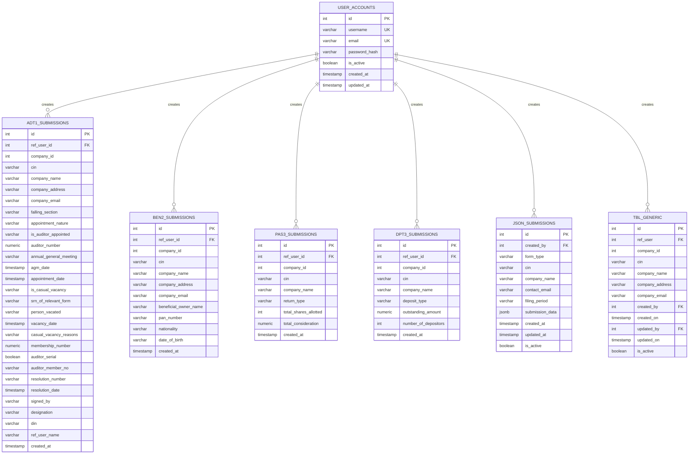
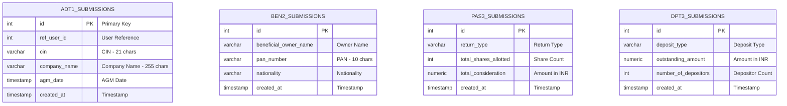
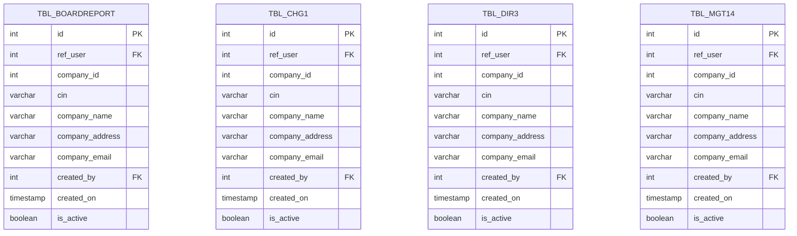
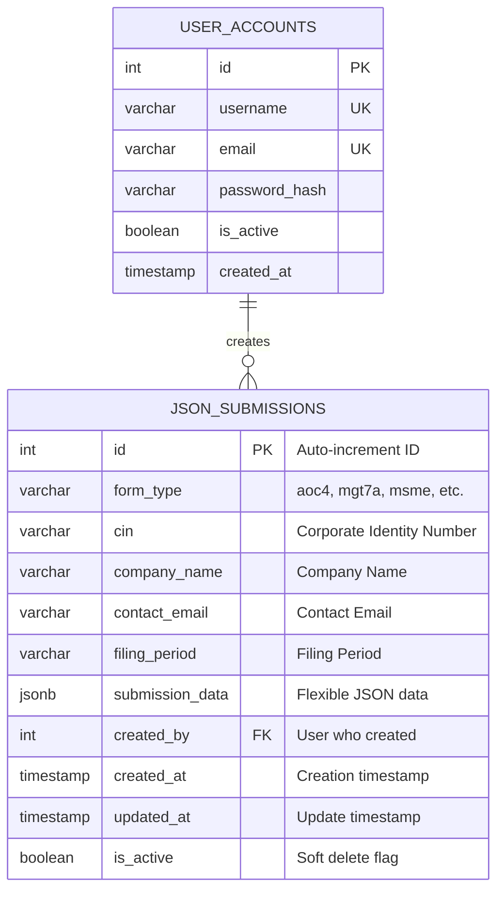
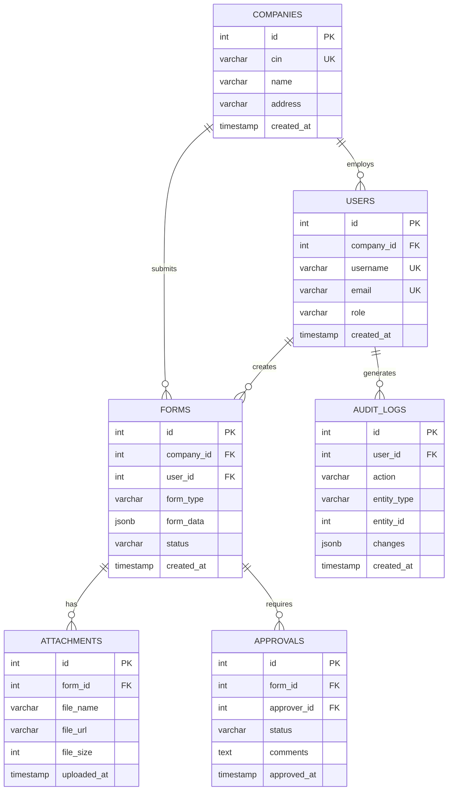

# 🗃️ Data Model Diagram
## ComplyCrafter - Complete Database Schema

**Version:** 1.0  
**Date:** October 31, 2025  
**Database:** PostgreSQL 15

---

## 📊 Complete Entity Relationship Diagram

---

## 📋 Phase 1 & 2 Forms - Detailed Schemas

---

## 📦 Phase 3+ Forms - Generic Schema Pattern

---

## 🗂️ JSON Submission Schema

---

## 🔗 Future Relationship Model

---

## 📊 Table Statistics

### **Current State**
| Category | Count | Description |
|----------|-------|-------------|
| **Form Tables** | 62 | Individual form submissions |
| **Auth Tables** | 1 | User accounts |
| **JSON Tables** | 1 | Flexible JSON submissions |
| **Total** | 64 | All database tables |

### **Table Size Distribution**
- **Small** (< 10 columns): 51 tables (Phase 3+)
- **Medium** (10-30 columns): 8 tables (Phase 1&2)
- **Large** (30+ columns): 5 tables (Complex forms)

### **Index Count**
- **Primary Keys:** 64 indexes
- **Unique Constraints:** 2 (username, email)
- **Custom Indexes:** 2 (username, email on user_accounts)
- **Total:** 68 indexes

---

## ✅ Data Model Features

| Feature | Implementation | Status |
|---------|----------------|--------|
| **Primary Keys** | SERIAL (auto-increment) | ✅ |
| **Foreign Keys** | Planned for relationships | 🎯 |
| **Unique Constraints** | username, email | ✅ |
| **Indexes** | Primary + custom | ✅ |
| **Timestamps** | created_at, updated_at | ✅ |
| **Soft Deletes** | is_active flag | ✅ |
| **Audit Fields** | created_by, updated_by | ✅ |
| **JSON Support** | JSONB columns | ✅ |

---

**Version:** 1.0  
**Database:** PostgreSQL 15  
**Tables:** 64  
**Status:** ✅ Production Ready

