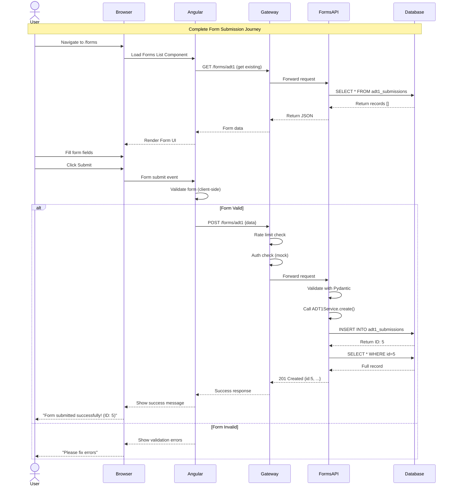
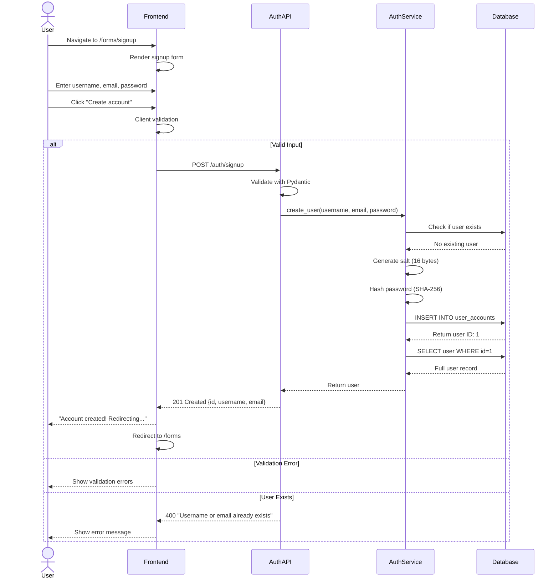
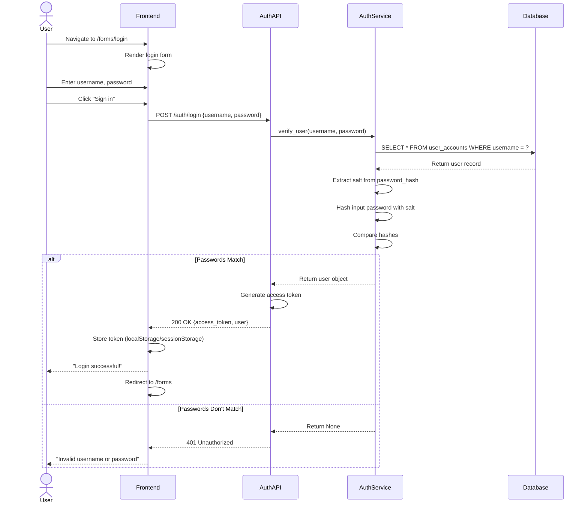
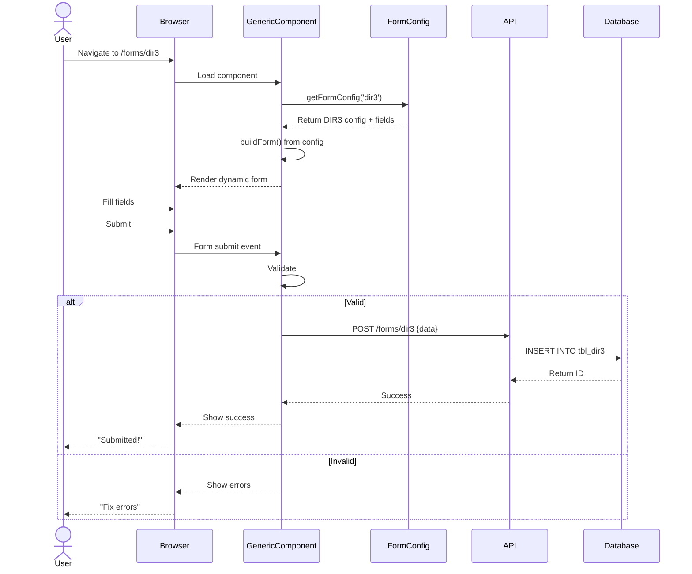
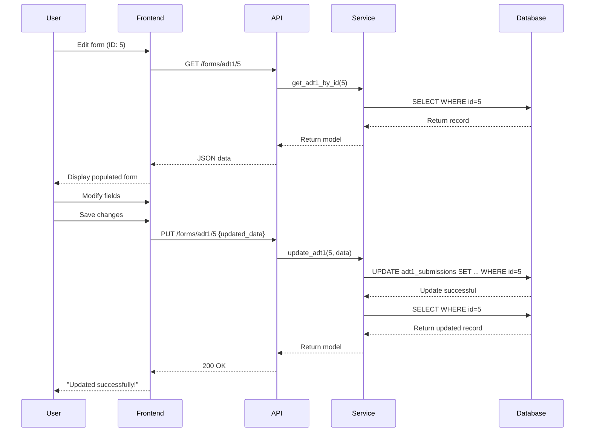
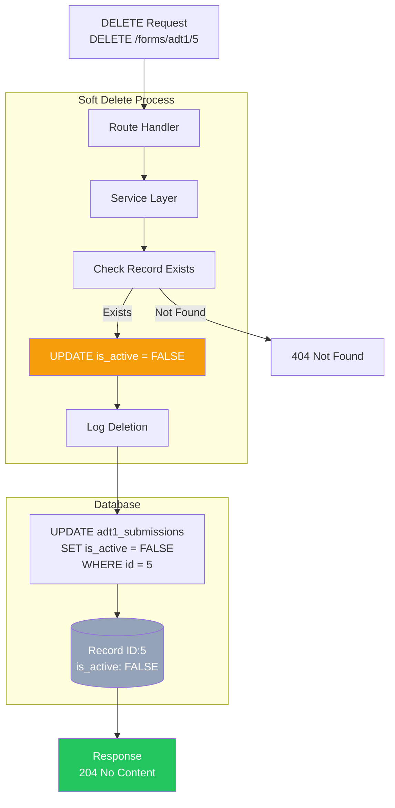
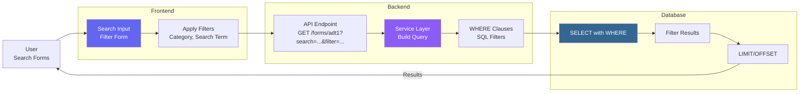
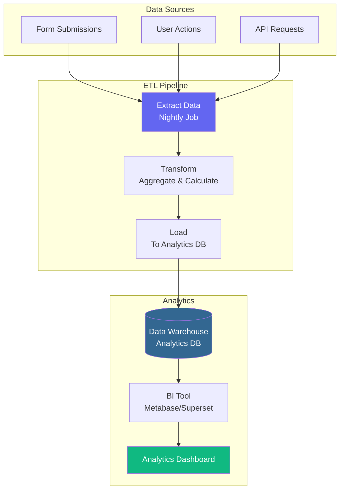
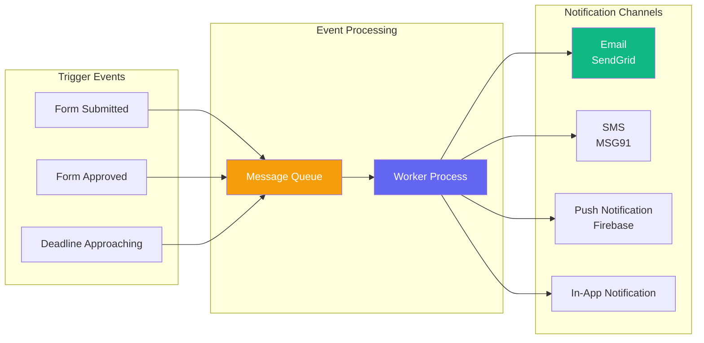

# 🔄 Data Flow Diagrams
## ComplyCrafter - Complete Data Flow Scenarios

**Version:** 1.0  
**Date:** October 31, 2025  
**Flows:** All Critical User Journeys

---

## 📋 Form Submission Flow (End-to-End)

---

## 🔐 User Signup Flow

---

## 🔓 User Login Flow

---

## 📝 Generic Form Submission Flow (Phase 3+)

---

## 🔍 Data Retrieval Flow

```mermaid
graph LR
    USER[User Request<br/>GET /forms/adt1]
    
    subgraph "Frontend"
        COMPONENT[Form Component]
        HTTP[HTTP Client]
    end

    subgraph "Backend"
        ROUTER[Route Handler<br/>/forms/adt1]
        SERVICE[ADT1 Service<br/>get_all_adt1]
        ORM[SQLAlchemy<br/>select query]
    end

    subgraph "Database"
        QUERY[SELECT * FROM<br/>adt1_submissions]
        INDEX[Use Primary Key Index]
        RESULT[Return Rows]
    end

    USER --> COMPONENT
    COMPONENT --> HTTP
    HTTP --> ROUTER
    ROUTER --> SERVICE
    SERVICE --> ORM
    ORM --> QUERY
    QUERY --> INDEX
    INDEX --> RESULT
    RESULT -->|JSON| ORM
    ORM -->|Models| SERVICE
    SERVICE -->|Pydantic| ROUTER
    ROUTER -->|JSON| HTTP
    HTTP -->|Observable| COMPONENT
    COMPONENT -->|Display| USER

    style COMPONENT fill:#6366f1,color:#fff
    style SERVICE fill:#8b5cf6,color:#fff
    style QUERY fill:#336791,color:#fff
```

---

## 🔄 Data Update Flow

---

## 🗑️ Data Deletion Flow (Soft Delete)

---

## 🔎 Search/Filter Flow

---

## 📊 Analytics Data Flow (Future)

---

## 🔔 Notification Data Flow (Future)

---

## ✅ Data Flow Summary

| Flow Type | Complexity | Status |
|-----------|------------|--------|
| **Form Submission** | Medium | ✅ Complete |
| **User Signup** | Low | ✅ Complete |
| **User Login** | Low | ✅ Complete |
| **Data Retrieval** | Low | ✅ Complete |
| **Data Update** | Medium | ✅ Complete |
| **Soft Delete** | Low | ✅ Complete |
| **Search/Filter** | Medium | 🎯 Planned |
| **Analytics** | High | 🎯 Future |
| **Notifications** | Medium | 🎯 Future |

---

**Version:** 1.0  
**Flows Documented:** 9  
**Status:** ✅ Complete

